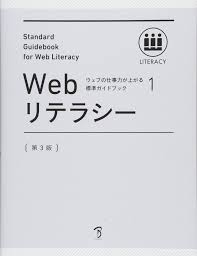

# WebLiteracy_study

ウェブの仕事力が上がる標準ガイドブック 1 Webリテラシー 第3版

**2020/11/20〜**

## 第1章　Webの基礎知識 (2020/11/24 Done)

### ~~01 インターネットとWebの歴史~~

### ~~02 WWWの仕組み~~

### ~~03 ブラウジング環境~~

### ~~04 サーバー環境~~

### ~~05 インターネットの問題点~~

### ~~06 コミュニケーションとしてのWeb~~

### ~~07 マーケティングとしてのWeb~~

## 第２章　インターネットビジネス

### 01 ~~インターネットの市場価値と影響力~~

### 02 ~~インターネットをビジネスに活かす~~

### 03 ~~インターネットのビジネスモデル~~

### 04 ~~インターネットのメディア特性~~

### 05 ~~インターネットのデータ活用とWebサービス~~

### 06 ~~モバイルインターネット~~

### 07 ~~スマートフォンアプリ~~

### 08 ~~ウェアラブルデバイス~~

### 09 ~~電子書籍~~

### 10 ~~コーポレートコミュニケーションとWebサイト~~

### 11 ~~ブランディングとCSR~~

### 12 ~~ECビジネス~~

### 13 ~~インターネット関連法規~~

### 14 ~~著作権~~

### 15 ~~クリエイティブ・コモンズ~~

## 第３章　プロジェクトマネジメント

### 01 ~~プロジェクトマネジメントの必要性~~

### 02 ~~予算の設定と管理~~

### 03 ~~スタッフの役割と管理~~

### 04 ~~リソー ス管理~~

### 05 ~~スケジュール管理~~

### 06 ~~PDCAサイクル~~

## 第4章　Webサイトの企画・設計

### 01 Webサイト制作のワークフロー

### 02 比較による現状分析

### 03 評価手法による現状分析

### 04 Webサイトの狙いとゴールの設定

### 05 コンテンツの企画

### 06 Webサイト設計の概論

### 07 サイト設計書

### 08 制作仕様書

### 09 情報アーキテクチャ設計

### 10 公開と運用